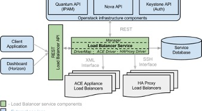

[← Back to README](../../README.md)

**Author:** Marco Celon  
**Published on:** November 21, 2012  
**Time:** 10:25 AM  
**Web Address:** http://thoughtsoncloud.com/index.php/2012/11/equilibrium-project-lbaas-load-balancer-as-a-service-in-openstack

---

## Article Reference: Thoughts on Cloud

*IBM Cloud Products and Services - Cloud computing conversations led by IBMers*

---

## Equilibrium Project: LBaaS (Load Balancer as a Service) in OpenStack

Load balancing is an important part of cloud infrastructure as mission critical web-based applications and workloads require a High Availability solution which helps distribute payloads and incoming traffic across multiple services, on premise or public clouds. Moreover "rapid elasticity" feature of a cloud environment has been included in the official [NIST's definition of cloud computing](http://csrc.nist.gov/publications/detail/sp/800-145/final). ComplianceOpenStack does not allow you to leverage fully automated management of load balancers. The Quantum module, introduced by the Folsom release, allows you to explicitly represent and manipulate the network topology in a unified way as a group of nodes and devices connected through ports; however, there is no system as efficient or flexible as an API service designed to manage multiple hardware and software based load balancers in a cloud.

These are the compelling reasons behind the development of the [LBaaS](http://wiki.openstack.org/LBaaS) functionalities for OpenStack ([Equilibrium project](http://wiki.openstack.org/Equilibrium) which may eventually be merged with the Quantum project. A dedicated OpenStack Contributions Team is working to create a service which exposes a single unified REST/API for managing different hardware-based (LB appliances, such on the cloud administrator side (manage the LB appliances) and on the tenant side (provide LB for an application). It is going to be designed specifically for [OpenStack](http://www.openstack.org/), but can also be used as a standalone service to manage a set of load balancers through a single unified API.

---

## OpenStack LBaaS Architecture Overview

*OpenStack LBaaS - Load Balancer Service Components*

---

There have been some sessions showing the first prototype of Quantum/Equilibrium working together at the latest [OpenStack Design Summit](http://www.openstack.org/community/events/design-summit/) and the first draft of the code is available for [download](http://github.com/). In the actual version the characteristics are:

- Provides load-balancing IP address with multiple instances as back-end
- Available drivers for haproxy, Cisco ACE and F5 BigIP (many additional vendors have already expressed their interest in the support)
- Integration with the Quantum project

I personally believe that the integration of [LBaaS](http://wiki.openstack.org/LBaaS) in OpenStack is a step towards providing all networking functions to the tenants and that should be managed as a separate project. With a tight integration it will evolve the Quantum project up the networking stack.

---

## About Marco Celon

Marco is an IBM cloud delivery specialist based in Australia. During his IBM tenure (2006-2012), he worked across three regions: Italy (2006-2010), Dubai/Middle East (2010-2012), and Australia (2012), with involvement in cloud proposals for SW Europe, MEA, and APAC markets. He is currently engaged with private cloud implementations in the Australia/New Zealand region.

---

*This blog post was originally published on Thoughts on Cloud, an IBM Cloud Products and Services platform for cloud computing conversations led by IBMers.*
